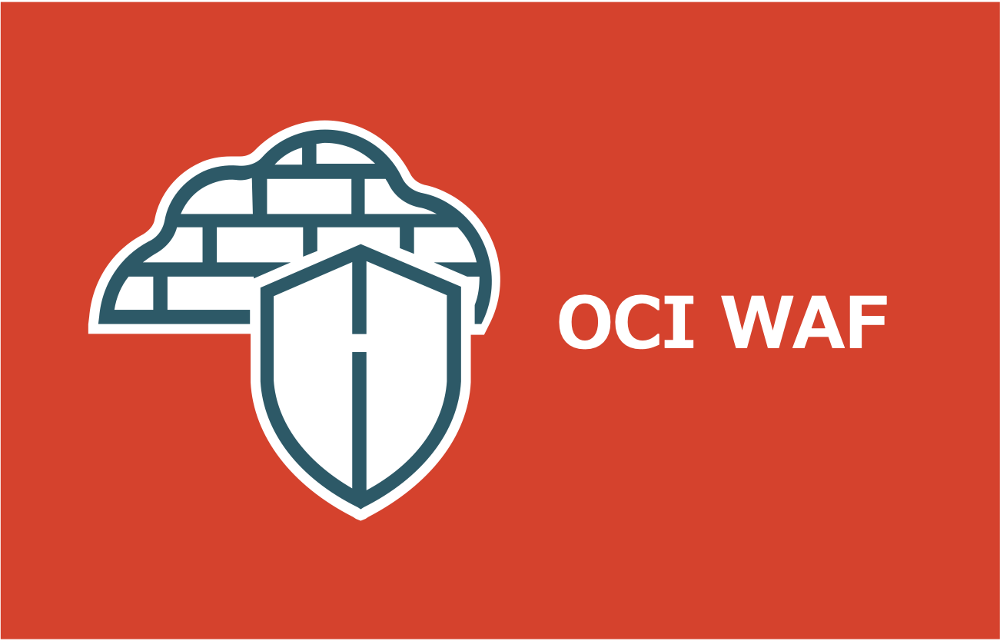
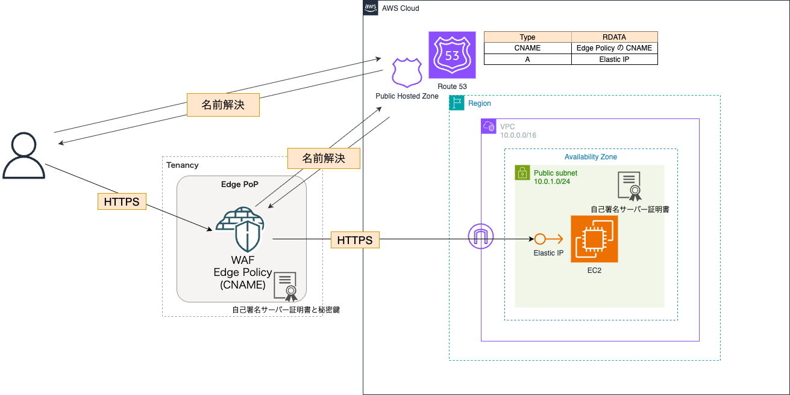

=====================================================================
OCI WAF エッジポリシーで Web アプリケーションを保護する
=====================================================================
* `詳細 <>`_

=====================================================================
構成図
=====================================================================

=====================================================================
デプロイ - Terraform -
=====================================================================

作業環境 - ローカル -
=====================================================================
* macOS Sequoia ( v15.7.2 )
* Visual Studio Code 1.106.3
* Terraform v1.13.5
* oci cli 3.71.0
* aws-cli/2.32.10 Python/3.13.9 Darwin/24.6.0 exe/arm64
* Python 3.14.2

フォルダ構成
=====================================================================
* `こちら <./folder.md>`_ を参照

前提条件
=====================================================================
* Amazon Route 53 にてドメインを購入していること
* もしくは、別のレジストラで購入後、Amazon Route 53 に委任していること

実作業 - ローカル -
=====================================================================
1. AWS 環境デプロイ
---------------------------------------------------------------------
* `詳細 <./envs/aws>`_

2. OCI 環境デプロイ
---------------------------------------------------------------------
* `詳細 <./envs/oci>`_

後片付け - ローカル -
=====================================================================

.. note::

    * 順不同

OCI 環境削除
---------------------------------------------------------------------
* `詳細 <./envs/oci>`_

AWS 環境削除
---------------------------------------------------------------------
* `詳細 <./envs/aws>`_

参考資料
=====================================================================
リファレンス
---------------------------------------------------------------------
* `terraform_data resource reference <https://developer.hashicorp.com/terraform/language/resources/terraform-data>`_
* `Backend block configuration overview <https://developer.hashicorp.com/terraform/language/backend#partial-configuration>`_
* `All Image Families - Oracle Cloud Infrastructure Documentation/Images <https://docs.oracle.com/en-us/iaas/images/>`_
* `タグおよびタグ・ネームスペースの概念 - Oracle Cloud Infrastructureドキュメント <https://docs.oracle.com/ja-jp/iaas/Content/Tagging/Tasks/managingtagsandtagnamespaces.htm#Who>`_
* `About the DNS Domains and Hostnames - Oracle Cloud Infrastructure Documentation <https://docs.oracle.com/en-us/iaas/Content/Network/Concepts/dns.htm#About>`_

ブログ
---------------------------------------------------------------------
* `Terraformでmoduleを使わずに複数環境を構築する - Zenn <https://zenn.dev/smartround_dev/articles/5e20fa7223f0fd>`_
* `Terraformでmoduleを使わずに複数環境を構築して感じた利点 - SpeakerDeck <https://speakerdeck.com/shonansurvivors/building-multiple-environments-without-using-modules-in-terraform>`_
* `個人的備忘録：Terraformディレクトリ整理の個人メモ（ファイル分割編） - Qiita <https://qiita.com/free-honda/items/5484328d5b52326ed87e>`_
* `Terraformの auto.tfvars を使うと、環境管理がずっと楽になる話 - note <https://note.com/minato_kame/n/neb271c81e0e2>`_
* `Terraform v1.9 では null_resource を安全に terraform_data に置き換えることができる -Zenn <https://zenn.dev/terraform_jp/articles/tf-null-resource-to-terraform-data>`_
* `Terraform cloudinit Provider を使って MIME multi-part 形式の cloud-init 設定を管理する - HatenaBlog <https://chaya2z.hatenablog.jp/entry/2025/10/15/040000>`_
* `【Terraform🧑🏻‍🚀】tfstateファイルの分割パターンとディレクトリ構成への適用 <https://hiroki-hasegawa.hatenablog.jp/entry/2023/07/05/001756>`_
* `Terraformで自己署名証明書の作成からALBの適用までを一発で実施する - DevelopersIO <https://dev.classmethod.jp/articles/terraform-self-signed-certificate-alb-setup/>`_